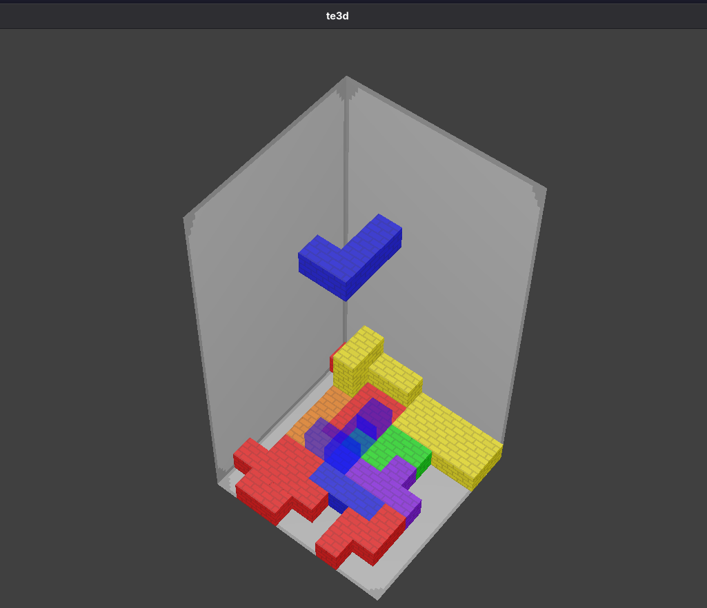

# Tetris 3D (de verdade).

## Descrição:
Uma simples cópia do Tetris, mas em três dimensões.

Não encontrei muitas versões do Tetris realmente 3D, há muitas opções com jogabilidade 2D e gráficos 3D, então quis fazer minha versão.

Aliás, preferi o ursina porque meu PCCT, o **mundi-pieces**, foi baseado nele, acho uma engine simples e poderosa, acredito que tenha sido a melhor escolha.

## Instalação
### pip:
```bash
# clona o repo
git clone https://github.com/rry-monteiro/tot.git
cd tot
pip install pyinstaller
pyinstaller tot.spec
# copia pro local
```

### UV (recomendado):
```bash
# clona o repo
git clone https://github.com/rry-monteiro/te3d.git
cd te3d
# sincroniza
uv sync
# compacta
uv run pyinstaller te3d.spec
```

As duas formas de instalação liberam o executável em `dist/`. 
## O Motivo
Tetris é um jogo conhecido mundialmente, todo mundo jogou tetris, mas nunca vi um tetris 3D, depois de procurar muito eu vi umas versões que não batiam muito com o que eu procurava, como [esse](), que tenta ser em 3D mas definitivamente não é, então resolvi construir com a engine mais simples e a linguagem que eu mais dominava;

E seu nome é um trocadilho com "teTRÊS-D"
## Controles
|tecla|comando|
|-|-|
|w|mover para frente no eixo z|
|a|mover para a esquerda no eixo x|
|s|mover para tras no eixo z|
|d|mover para a direita no eixo x|
|1|rotacionar no eixo y|
|2|rotacionar no eixo x|
|3|rotacionar no eixo z|
|space|drop da peça|

## Imagens:
